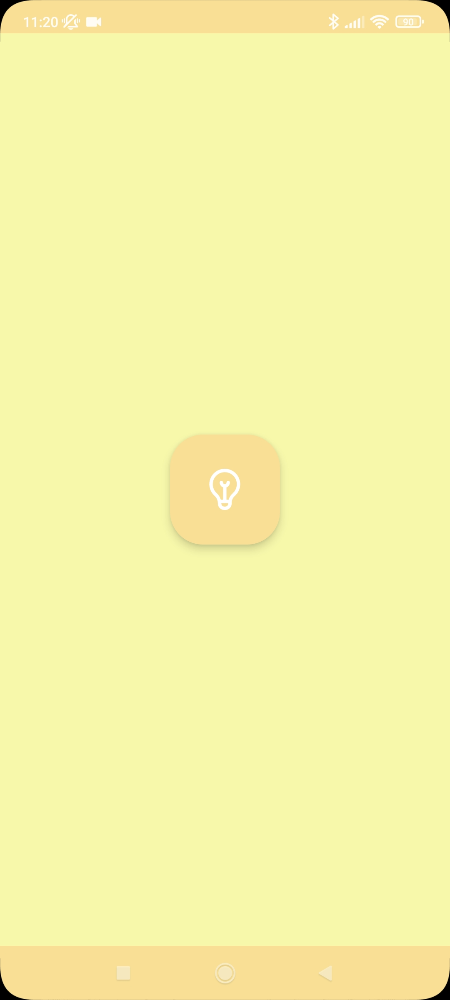
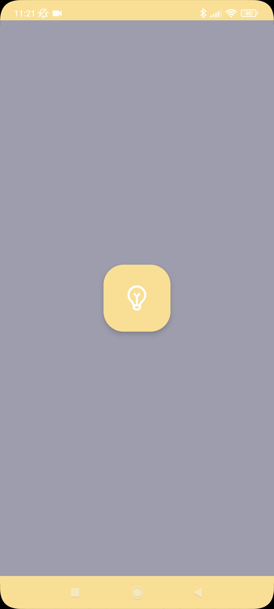
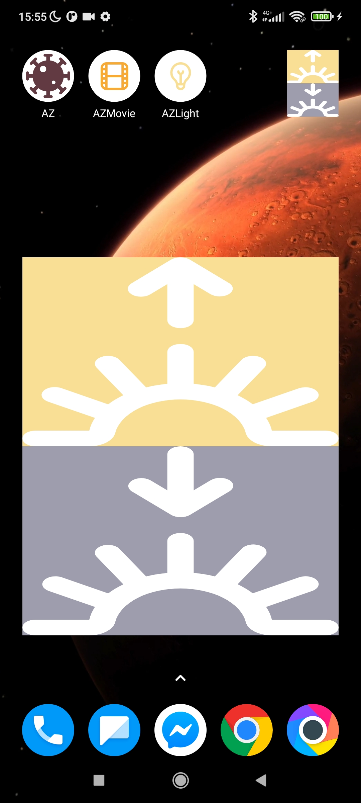

# AZLight

[](https://lv.binarybabel.org/catalog/gradle/latest)
[](https://android-arsenal.com/api?level=21)


# Introduction
###
> AZLight is a small android app for connecting esp8266 to turn on and off lights

>  app to turn off and turn on home lights using widgets and esp8266

resizable widget


<!-- Demo| Widget add | Widget add | Turn on | Turn off
---|---|---|---|
 |    |    |   

 -->
Demo| Widget add | Widget| Turn on| Turn off
---|---|---|---|---|
 |   |   |   |   


* Tech-stack
    * [100% Kotlin](https://kotlinlang.org/) + [Coroutines](https://kotlinlang.org/docs/reference/coroutines-overview.html)
    * [Dagger2](https://github.com/google/dagger) - Dependency Injection lib with large community support.
    * [Retrofit](https://square.github.io/retrofit/) - Network Http Client
    * [Moshi](https://github.com/square/moshi) - Data, Model & Entity JSON Parser that understands Kotlin non-nullable and default parameters


The full list of dependencies are written in the **build.gradle** files.


## Getting started

There are a few ways to open this project.

### Android Studio

1. `Android Studio` -> `File` -> `New` -> `From Version control` -> `Git`
2. Enter `https://github.com/annzzu/AZMovie.git` into URL field an press `Clone` button

### Command-line + Android Studio

1. Run `git clone https://github.com/annzzu/AZMovie.git` command to clone project
2. Open `Android Studio` and select `File | Open...` from the menu. Select cloned directory and press `Open` button


`API in gradle.properties`
```gradle.properties
SERVER_URL=http://**Localhost:)**/
```

## Inspiration

This project is for my confort to turn on and off lights in my room.

### Android projects by me
- [Covid Restrictions](https://github.com/annzzu/AZ) - AZ - For finding worldwide covid restriction and planing Travel.
- [AZMovie](https://github.com/annzzu/AZMovie) - AZMovie - For  for watching movies and series without any ads.

## Questions
If you have any questions about this projects, please contact me directly at 
